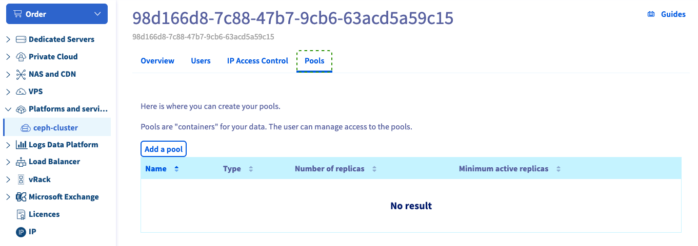
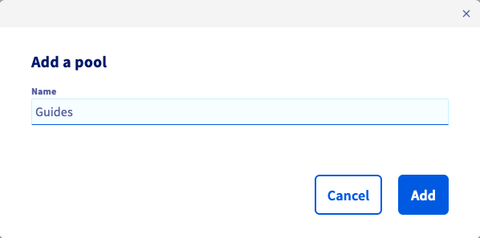

## Using web interface


> [!primary]
>
> Using web interface is the easiest way to create a pool.
> 

First, connect to the [manager](https://ca.ovh.com/manager/dedicated/#/configuration){.external} and under Platforms and services you'll fine the Ceph service. 

In the tab 'Pools' and then on the bottom right, you will find the existing pools.


{.thumbnail}

Enter a poolname, your pool needs at least three characters.


{.thumbnail}

After pool creation you are back to manager, you can see that cluster status has changed because the pool is being created.


{.thumbnail}


## Using API

> [!api]
>
> @api {POST} /dedicated/ceph/{serviceName}/pool
> 
serviceName is the fsid of your cluster.

You can check pool creation by listing pools.


> [!api]
>
> @api {GET} /dedicated/ceph/{serviceName}/pool
> 
For example:


```bash
GET /dedicated/ceph/98d166d8-7c88-47b7-9cb6-63acd5a59c15/pool
[
{
  replicaCount: 3
  serviceName: "98d166d8-7c88-47b7-9cb6-63acd5a59c15"
  name: "rbd"
  minActiveReplicas: 2
  poolType: "REPLICATED"
  backup: false
},
{
  replicaCount: 3
  serviceName: "98d166d8-7c88-47b7-9cb6-63acd5a59c15"
  name: "testpool"
  minActiveReplicas: 2
  poolType: "REPLICATED"
  backup: true
  }
]
```