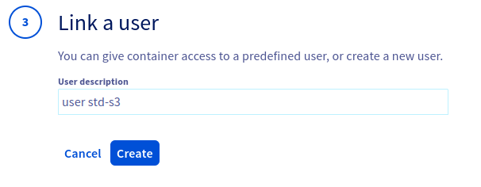

**Dernière mise à jour le 27/09/2022**

## Objectif

**Ce guide a pour objectif de vous familiariser avec la création d'un bucket.**

> [!primary]
>
> - Si vous êtes intéressé par la classe de stockage ***Standard object storage - SWIFT API***, veuillez suivre ce [guide](https://docs.ovh.com/fr/storage/pcs/creation-de-conteneur/).
> - Si vous êtes intéressé par la classe de stockage ***Cloud Archive - SWIFT API***, veuillez suivre ce [guide](https://docs.ovh.com/fr/storage/pca/creation-de-conteneur/).
>

## Prérequis

- Un [projet Public Cloud](https://www.ovhcloud.com/fr/public-cloud/) dans votre compte OVHcloud
- Être connecté à votre [espace client OVHcloud](https://www.ovh.com/auth/?action=gotomanager&from=https://www.ovh.com/fr/&ovhSubsidiary=fr)

## En pratique

### Utilisation de l'espace client

Pour créer un bucket Object Storage, vous devez d'abord vous connecter à votre [espace client OVHcloud](https://www.ovh.com/auth/?action=gotomanager&from=https://www.ovh.com/fr/&ovhSubsidiary=fr) et ouvrir votre projet `Public Cloud`{.action}. Cliquez sur `Object Storage`{.action} dans la barre de navigation à gauche puis sur l'onglet `Mes conteneurs`{.action}.

Cliquez sur `Créer un conteneur d'objet`{.action} et sélectionnez votre classe de stockage:

Sélectionnez une région :

> [!primary]
>
> Les régions peuvent varier suivant la classe de stockage sélectionnée.
>

Vous devez lier un utilisateur au bucket :

Pour cela, vous pouvez lier un utilisateur S3 existant :

Vous pouvez voir les informations d'identification de l'utilisateur, en cliquant sur `View credentials`{.action} :

Si vous n'en avez pas déjà, vous pouvez créer un nouvel utilisateur S3 :

Les informations d'identification de l'utilisateur sont alors affichées :

Pour finir, nommez votre bucket :

Félicitations, votre bucket est créé :

### Où trouver l'URL Endpoint d'un bucket

Cliquez sur le nom de votre bucket pour en afficher les détails et le contenu :

## Aller plus loin

Échangez avec notre communauté d'utilisateurs sur <https://community.ovh.com>.
