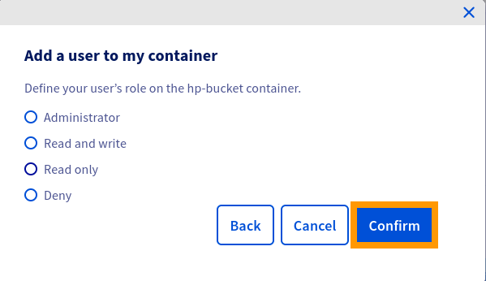
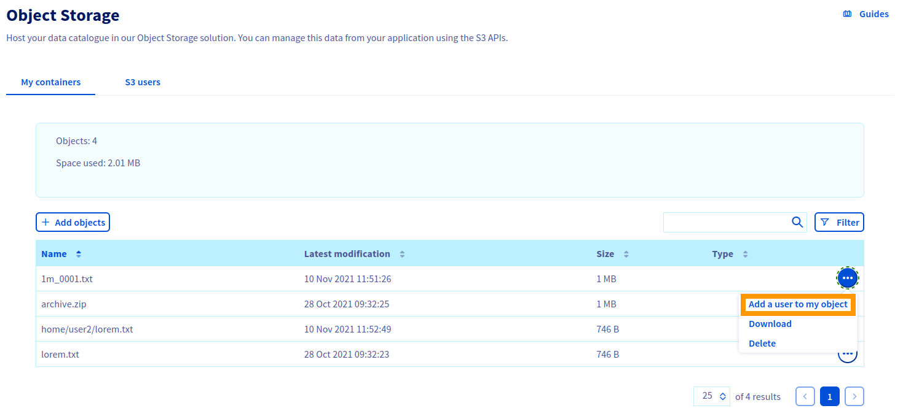
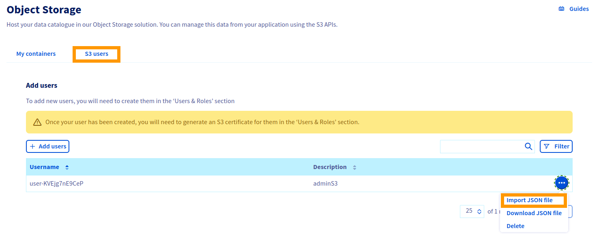

**Dernière mise à jour le 08/12/2021**

## Objectif

Ce guide a pour objectif de vous montrer la gestion de vos identités et accès à vos ressources S3 Object Storage.

## Prérequis

- Être connecté à votre [espace client OVHcloud](https://ca.ovh.com/auth/?action=gotomanager&from=https://www.ovh.com/ca/fr/&ovhSubsidiary=qc){.external}.
- Avoir créé un [utilisateur S3](https://docs.ovh.com/ca/fr/storage/s3/debuter-avec-s3/).

## En pratique

### Actions possibles via l'espace client

Connectez-vous à [l'espace client OVHcloud](https://ca.ovh.com/auth/?action=gotomanager&from=https://www.ovh.com/ca/fr/&ovhSubsidiary=qc), accédez à la section `Public Cloud`{.action} et sélectionnez le projet Public Cloud concerné. Cliquez ensuite sur `Object Storage`{.action} dans le menu de gauche.

#### Gestion des accès à un bucket via un profil

Vous avez la possibilité de définir l'accès à vos buckets via des profils prédéfinis.

Cliquez sur les `...`{.action} à la fin de la ligne de votre bucket puis sur `Ajouter un utilisateur à un conteneur`{.action}


Sélectionnez l'utilisateur à ajouter à votre bucket et cliquez sur `Suivant`{.action}.


Définissez les accès à votre bucket pour cet utilisateur et cliquez sur `Confirmer`{.action}.



#### Gestion des accès à un objet via un profil

Vous pouvez également définir l'accès à vos objets via des profils prédéfinis.

Cliquez sur les `...`{.action} à la fin de la ligne de votre objet puis sur `Ajouter un utilisateur à mon object`{.action}.



Sélectionnez l'utilisateur et cliquez sur `Suivant`{.action}.


Sélectionnez le profil d'accès pour cet utilisateur et cliquez sur `Confirmer`{.action}.


#### Gestion avancée des accès aux ressources

Vous pouvez cependant affiner les droits via l'import d'un fichier de configuration JSON. Pour cela, rendez-vous dans l'onglet `Utilisateurs de stratégies S3`{.action}.



Cliquez sur les `...`{.action} à la fin de la ligne de votre utilisateur puis sur `Importer un fichier JSON`{.action}.

> [!primary]
>
> Si vous souhaitez modifier les droits d'un utilisateur, téléchargez éventuellement le fichier de configuration JSON au préalable en sélectionnant `Télécharger le fichier JSON`{.action}.
>

Quelques exemples de fichiers de configuration JSON :

**Accès en lecture / écriture à un bucket et à ses objets**

```json
{
  "Statement":[{
    "Sid":"RWContainer",
    "Effect":"Allow",
    "Action":["s3:GetObject","s3:PutObject","s3:DeleteObject","s3:ListBucket","s3:ListMultipartUploadParts","s3:ListBucketMultipartUploads","s3:AbortMultipartUpload","s3:GetBucketLocation"],
    "Resource":["arn:aws:s3:::hp-bucket","arn:aws:s3:::hp-bucket/*"]
  }]
}
```

**Accès en lecture seule à un bucket et à ses objets**

```json
{
  "Statement":[{
    "Sid":"ROContainer",
    "Effect":"Allow",
    "Action":["s3:GetObject","s3:ListBucket","s3:ListMultipartUploadParts","s3:ListBucketMultipartUploads"],
    "Resource":["arn:aws:s3:::hp-bucket","arn:aws:s3:::hp-bucket/*"]
  }]
}
```

**Autoriser toutes les opérations sur toutes les ressources d'un projet**

```json
{
  "Statement":[{
    "Sid":"FullAccess",
    "Effect":"Allow",
    "Action":["s3:*"],
    "Resource":["*"]
  }]
}
```

**Accès en lecture / écriture à tous les objets d'un dossier spécifique ("/home/user2") d'un bucket spécifique ("companybucket")**

```json
{
  "Statement":[{
    "Sid":"RWContainer",
    "Effect":"Allow",
    "Action":["s3:GetObject","s3:PutObject","s3:DeleteObject","s3:ListBucket","s3:ListMultipartUploadParts","s3:ListBucketMultipartUploads","s3:AbortMultipartUpload","s3:GetBucketLocation"],
    "Resource":["arn:aws:s3:::companybucket","arn:aws:s3:::companybucket/home/user2/*"]
  }]
}
```


### Liste des actions supportées

| Action  | Scope  |
|:--|:--|
| s3:AbortMultipartUpload | Object |
| s3:CreateBucket | Bucket |
| s3:DeleteBucket | Bucket |
| s3:DeleteObject | Object |
| s3:GetBucketLocation | Bucket |
| s3:GetObject | Object |
| s3:ListBucket | Bucket |
| s3:ListBucketMultipartUploads | Bucket |
| s3:ListMultipartUploadParts | Object |
| s3:PutObject | Object |

## Aller plus loin

Échangez avec notre communauté d'utilisateurs sur [https://community.ovh.com](https://community.ovh.com){.external}.
