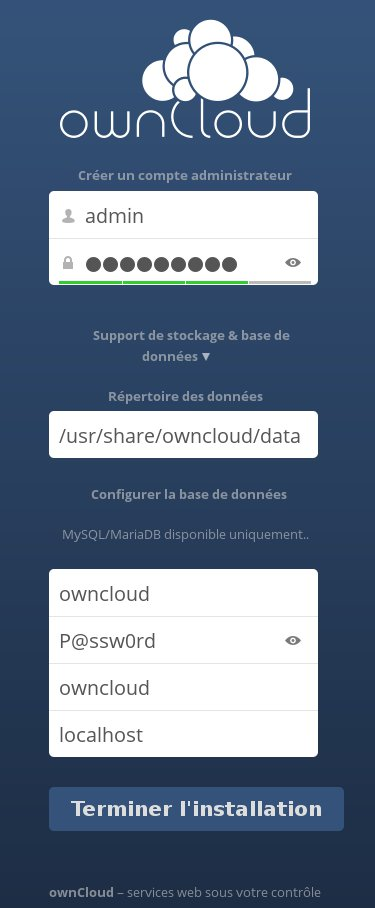

**Dernière mise à jour le 20 mai 2022**

## Objectif

[ownCloud](https://owncloud.org/) est une application de stockage et de gestion de fichiers en ligne.
Cette solution offre plusieurs fonctionnalités, dont la synchronisation entre plusieurs appareils. Vous pouvez également ajouter du stockage externe comme l'Object Storage d'OpenStack.

** Ce guide vous explique comment configurer votre ownCloud avec Object Storage.**


## Requirements

- Le fichier OpenRC, obtenu depuis l'[espace client OVHcloud](https://docs.ovh.com/ca/fr/public-cloud/creation-et-suppression-dun-utilisateur-openstack/) ou [Horizon](https://docs.ovh.com/ca/fr/public-cloud/presentation-dhorizon/)
- [Espace de stockage](https://docs.ovh.com/ca/fr/storage/pcs/creation-de-conteneur/) dédié à ownCloud


## Instructions

### Installation

Vous devez d'abord installer ownCloud :

```bash
root@instance:~$ apt install owncloud
```

> [ ! primary]
>
> Assurez-vous que le référentiel que vous utilisez contient la dernière version de ownCloud.
>

Pour fonctionner, OwnCloud doit disposer d'une base de données MySQL. Si vous n’en avez pas, installez-le en exécutant la commande suivante :

```bash
root@instance:~$ apt install mysql-server
```

### Configuration

Pour configurer la base de données qui sera utilisée par ownCloud, connectez-vous à votre serveur MySQL avec le mot de passe root défini lors de l'installation du serveur :


```bash
root@instance:~$ mysql -u root -p
```

À ce stade, vous pouvez créer un nouvel utilisateur et une base de données dédiée à ownCloud :

```sql
***** Créer un utilisateur ****
mysql> CREATE USER 'owncloud'@'localhost' IDENTIFIED BY 'P@ssw0rd';

***** Créer une base de données ****
mysql> CREATE DATABASE `owncloud` ;

***** Accorder tous les privilèges sur "ownCloud" à la base de données "owncloud" ****
mysql> ACCORDER TOUS LES PRIVILÈGES SUR 'owncloud' . * À 'owncloud'@'localhost';
```

Connectez-vous à ownCloud sur votre navigateur en saisissant : `http://serverIP/owncloud`:

{.thumbnail}

Dans cette interface :

- Créer un compte administrateur.
- Renseignez le répertoire de données (facultatif, si vous souhaitez simplement utiliser l'Object Storage, vous pouvez laisser celui par défaut).
- Indiquez les identifiants de votre base de données.


Après avoir validé l'opération, vous pouvez accéder à votre interface OwnCloud et activer l'application qui vous permet d'ajouter un support de stockage externe.

Pour ce faire, cliquez sur `Fichier`{.action} en haut à gauche et sélectionnez `Applications`{.action} :

{.thumbnail}

Activez ensuite l'application `External storage support`{.action} depuis le menu des applications `Disabled`.

{.thumbnail}

Une fois ceci fait, configurez cette application en cliquant sur votre nom d'utilisateur en haut à droite et en sélectionnant `Admin`{.action} :

{.thumbnail}

Dans le menu `External storage`, sélectionnez `Add storage`{.action} et `OpenStack Object Storage`{.action} :

{.thumbnail}

Saisissez les informations de votre fichier OpenRC :

- Votre identifiant Horizon qui correspond au champ "OS_USERNAME" du fichier OpenRC
- Le nom de votre container que vous avez créé précédemment pour ownCloud
- La région dans laquelle se trouve votre container : "OS_REGION_NAME"
- Le nom du tenant, correspondant au champ "OS_TENANT_NAME"
- Votre mot de passe Horizon
- Le nom du service correspondant à "Swift"
- l'adresse du point de terminaison, correspondant au champ "OS_AUTH_URL" ou "https://auth.cloud.ovh.net/v3" ;


La "clé d'API" et le "Temps d'attente maximum" sont optionnels.

> [ ! primary]
>
> Le conteneur que vous avez créé doit être entièrement dédié à ownCloud car l'application va utiliser des métadonnées.
>
> Une fois les informations complétées et vérifiées, la pastille rouge devant le nom de votre dossier devient verte et est accessible dans la rubrique `Stockage externe` de votre page d'accueil :
>


{.thumbnail}


## Aller plus loin

Échangez avec notre communauté d'utilisateurs sur <https://community.ovh.com/>.
