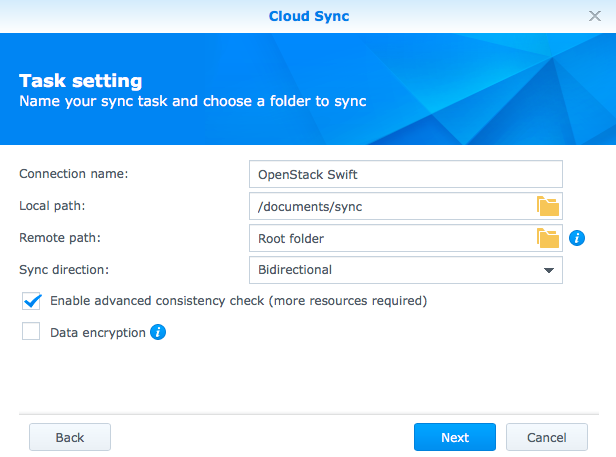

> [!primary]
> Questa traduzione è stata generata automaticamente dal nostro partner SYSTRAN. I contenuti potrebbero presentare imprecisioni, ad esempio la nomenclatura dei pulsanti o alcuni dettagli tecnici. In caso di dubbi consigliamo di fare riferimento alla versione inglese o francese della guida. Per aiutarci a migliorare questa traduzione, utilizza il pulsante "Modifica" di questa pagina.
>

**Ultimo aggiornamento: 27/10/2021**

## Obiettivo

[DiskStation Manager 6.0](https://www.synology.com/en-global/dsm/6.0beta){.external} di Synology propone uno strumento di sincronizzazione con diverse soluzioni Cloud.

Questo è compatibile con l'Object Storage Public Cloud OVHcloud e vi permetterà di fare un backup dei vostri dati e di renderli accessibili da qualsiasi punto.

**Questa guida ti mostra come configurare DiskStation Manager 6.0 per sincronizzare i file presenti sul tuo NAS verso il tuo Object Storage.**

## Prerequisiti

- [Crea un container Object Storage](https://docs.ovh.com/it/storage/pcs/creazione-container/)
- [Creare un utente per accedere a Horizon](https://docs.ovh.com/it/public-cloud/creation-and-deletion-of-openstack-user/#crea-un-utente-openstack)

## Procedura

### Configurazione di DiskStation Manager 6.0

> [!warning]
>
> Le soluzioni Synology come DiskStation o Hyperbackup non sono compatibili con l'offerta Public Cloud Archive
>

#### Recupero delle credenziali Openstack

Per configurare la sincronizzazione del tuo NAS Synology, è necessario disporre delle credenziali dell'utente OpenStack.

Per recuperarli, scarica il file OpenRC utilizzando la prima parte di questa guida:

- [Impostare le variabili d'ambiente OpenStack](https://docs.ovh.com/it/public-cloud/impostare-le-variabili-dambiente-openstack/#step-1-recupera-le-variabili){.ref}

#### Configurazione del punto di sincronizzazione con Cloud Sync

Una volta recuperate le credenziali, potete collegarvi al vostro NAS ed effettuare queste diverse azioni:

- Avvia l'applicazione Cloud Sync:

{.thumbnail}

- Seleziona OpenStack Swift come Cloud Providers

{.thumbnail}

- Inserisci le informazioni del tuo utente OpenStack:

{.thumbnail}

Tutte queste informazioni sono disponibili nel file OpenRC recuperato nel precedente step.

- Configura la tua cartella da sincronizzare

{.thumbnail}

> [!alert]
>
> Questa guida è basata sulla versione beta di DiskStation Manager 6.0, la procedura di configurazione può essere portata a modificare.
>

## Per saperne di più

Contatta la nostra Community di utenti all’indirizzo <https://community.ovh.com/en/>.