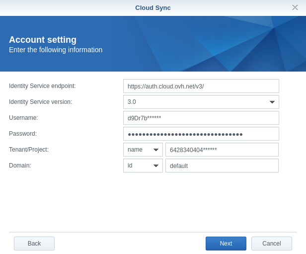

> [!primary]
> Tłumaczenie zostało wygenerowane automatycznie przez system naszego partnera SYSTRAN. W niektórych przypadkach mogą wystąpić nieprecyzyjne sformułowania, na przykład w tłumaczeniu nazw przycisków lub szczegółów technicznych. W przypadku jakichkolwiek wątpliwości zalecamy zapoznanie się z angielską/francuską wersją przewodnika. Jeśli chcesz przyczynić się do ulepszenia tłumaczenia, kliknij przycisk „Zaproponuj zmianę” na tej stronie.
>

**Ostatnia aktualizacja z dnia 27-10-2021**

## Wprowadzenie

[DiskStation Manager 6.00](https://www.synology.com/en-global/dsm/6.0beta){.external} Synology oferuje narzędzie synchronizacji z różnymi rozwiązaniami Cloud.

Jest on kompatybilny z Object Storage w Public Cloud OVHcloud, dzięki czemu będziesz mógł wykonywać kopie zapasowe danych i udostępniać je w dowolnym miejscu.

**Niniejszy przewodnik wyjaśnia, jak skonfigurować DiskStation Manager 6.0 w celu synchronizacji plików z serwerem NAS do Object Storage.**

## Wymagania początkowe

- [Utwórz kontenera Object Storage](https://docs.ovh.com/pl/storage/pcs/create-container/)
- [Zapewnienie dostępu do interfejsu Horizon](https://docs.ovh.com/pl/public-cloud/tworzenie-i-usuwanie-uzytkownika-openstack/#tworzenie-uzytkownika-openstack)

## W praktyce

### Konfiguracja DiskStation Manager 6.0

> [!warning]
>
> Rozwiązania Synology, takie jak DiskStation lub Hyperbackup, nie są kompatybilne z ofertą Public Cloud Archive
>

#### Pobranie identyfikatorów Openstack

Aby skonfigurować synchronizację usługi NAS Synology, należy posiadać identyfikatory użytkownika OpenStack.

Możesz je pobrać pobierając plik OpenRC z pierwszej części przewodnika:

- [Pobranie zmiennych środowiskowych OpenStack](https://docs.ovh.com/pl/public-cloud/zmienne-srodowiskowe-openstack/#etap-1-zgromadzenie-zmiennych){.ref}

#### Konfiguracja punktu synchronizacji z Cloud Sync

Po uzyskaniu danych dostępowych możesz zalogować się na serwerze NAS i wykonać następujące operacje:

- Uruchom aplikację Cloud Sync:

{.thumbnail}

- Wybierz OpenStack Swift jako Cloud Providers

{.thumbnail}

- Wpisz dane użytkownika OpenStack:

{.thumbnail}

Wszystkie te informacje można znaleźć w pliku OpenRC, który pobrałeś podczas poprzedniego etapu.

- Skonfiguruj folder do synchronizacji

{.thumbnail}

> [!alert]
>
> Niniejszy przewodnik oparty jest na wersji beta DiskStation Manager 6.0. Procedura konfiguracji może ulec zmianie.
>

## Sprawdź również

Dołącz do społeczności naszych użytkowników na stronie <https://community.ovh.com/en/>.